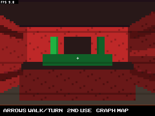
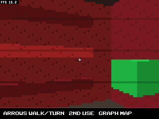
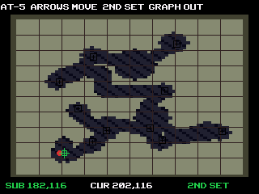
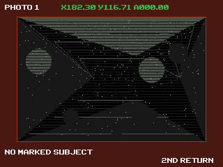

# TI_LUNG

TI_LUNG is a standalone TI-84 Plus CE submarine-horror game built on an
extended version of the T3D3 fixed-point renderer. It is an original
calculator-scale interpretation of the navigation-and-photography structure
of *Iron Lung*; it uses newly written code and procedural visuals rather than
ripped game assets.

## Current game

- A walkable, freely rotating polygon cabin rendered at 80 x 60 and presented
  at 320 x 240.
- Twenty world-space rectangular meshes form the console, welded hatch,
  instrument strip, camera monitor/button, extinguisher, ceiling light, wall
  map, and side pipes.
- Palette face lighting, depth shading, sparse welded seams, and
  coordinate-stable corrosion texture.
- A 950 x 950 navigation chart with a movable coordinate cursor. `2nd` stores
  the cursor as a waypoint, while the helm shows the selected X/Y target.
- Four proximity rays (front, right, back, and left), solid cave collision,
  heading and coordinate instruments, pressure, oxygen, leaks, and fire.
- Ten survey coordinates with position and heading tolerances.
- Camera charging, frozen developed photographs, coordinate/heading stamps,
  noise, cave perspective derived from the current proximity rays, and
  coordinate-seeded scenery so different positions do not reuse one image.
- Scripted proximity returns, impacts, navigation displacement, fire,
  extinguisher interaction, pressure loss, a late camera encounter, and an
  ending sequence.
- FPS is always displayed in the upper-left corner.

## Controls

On the title screen:

- `2nd`: descend and enter the cabin
- `Clear`: abort

Walking inside the cabin:

- Arrow up/down: walk forward/backward
- Arrow left/right: turn
- `2nd`: use the station currently in front of you
- `Graph`: open or close the map
- `Mode`: open or close the briefing
- `Clear`: exit

At the helm:

- Arrow up/down: move the submarine forward/backward
- Arrow left/right: rotate the submarine
- `2nd`: release the helm

On the map:

- Arrow keys: move the coordinate cursor in five-unit steps
- `2nd`: set the cursor as the helm waypoint
- `Graph` or `Mode`: return to the cabin

At the rear camera, face the camera station and press `2nd` to take a
photograph. Press `2nd` or `Mode` to leave the developed photograph. During a
fire, face the extinguisher station and press `2nd` repeatedly to suppress it.

## Verified screens

The screenshots below come from a headless CEmu run whose test sequence first
presses and releases `2nd`, then verifies the game's view-state byte before
exporting the LCD buffer.









The current captures report 9.8 FPS while facing the geometry-dense front
console and 15.0 FPS at the camera wall. The first full-frame texture attempt
dropped the same renderer to roughly 4 FPS, so the final material pass visits
only sparse corrosion samples and four weld rows.

## Renderer changes

TI_LUNG still uses T3D3's fixed-point camera transform, near clipping,
face-light palette, depth ordering, polygon rasterizer, dirty presenter, room
collision, and 4x low-resolution presentation. The reusable engine additions
are opt-in compile-time features:

- `T3D3_STATIC_BOX_LIMIT`: independent-extents static world boxes, exact
  camera-space bounds, conservative frustum rejection, visible-face
  submission, and far-to-near ordering.
- `T3D3_MATERIAL_TEXTURE`: a sparse palette-shade material pass designed for
  calculator cost rather than a full-screen texture scan.

The public static-scene API is `engine_static_scene_reset()` plus
`engine_spawn_static_box()`. Normal PortalR/T3D3 builds leave both features at
zero and retain their prior memory layout.

[Virtual3D](https://github.com/TheMachine02/Virtual3D) was evaluated as a
reference because it supports texture mapping, clipping, double buffering,
depth sorting, and mipmapping. Its 320 x 240 double-buffer architecture and
documented unfinished lighting/clipping work made a wholesale integration a
poor fit for this game's RAM and stability goals, so no Virtual3D code or
assets are copied here. Virtual3D is published under its repository's
[MIT/BSD-style license terms](https://github.com/TheMachine02/Virtual3D/blob/main/LICENSE).

## Build and tests

Build with CEdev 15 or newer:

```text
make -B
make budget
```

Transfer `bin/TILUNG.8xp` and the CE C libraries to the calculator. The current
program is 43,093 bytes compressed. The memory audit budgets code, data, BSS,
and a 4 KiB stack at 134,590 / 153,600 bytes, leaving 19,010 bytes.

The deterministic tests in `tests/cemu` cover:

- `front_cabin_autotest.json`: presses `2nd` and verifies the cabin state;
- `camera_turn_autotest.json`: rotates through the formerly crashing camera
  angle and verifies the program stays in the cabin;
- `map_cursor_autotest.json`: opens the map, moves the cursor, stores a
  waypoint, and remains in the map state;
- `capture_photo_autotest.json`: reaches the rear camera, takes one exposure,
  and verifies both the photograph state and exposure counter.
